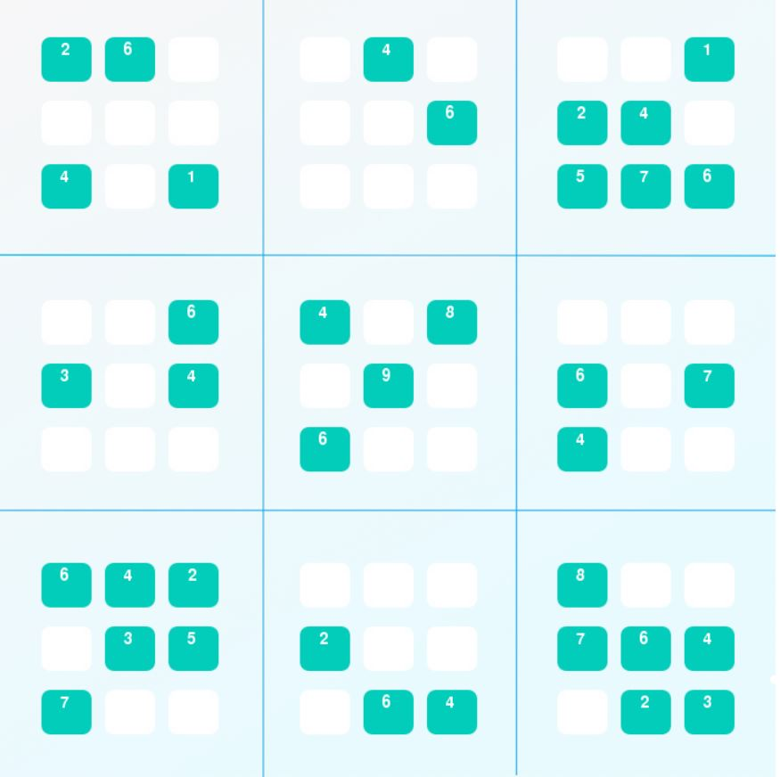

# Udacity- Artificial Intelligence Nanodegree

 <a href="https://www.udacity.com/course/artificial-intelligence-nanodegree--nd889">
The Nanodegree's website</a> 

### Projects
- [x] [Project 0: Diagonal Sudoku Solver](https://github.com/Sally-Ng/AIND-Diagonal_Sudoku_Solver)
- [ ] Project 1: Build a Game-Playing Agent
- [ ] Project 2: Implement a Planning Search
- [ ] Project 3: Design a Sign Language Recognition System
 
 

[Project 0: Diagonal Sudoku Solver](https://github.com/Sally-Ng/AIND-Diagonal_Sudoku_Solver)  
Techniques: Constraint Propagation and Search  
Built an intelligent agent that can solve sudoku  

  

